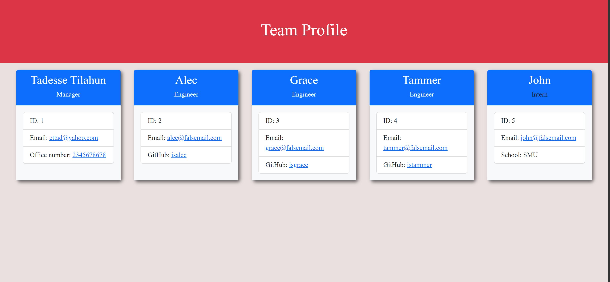
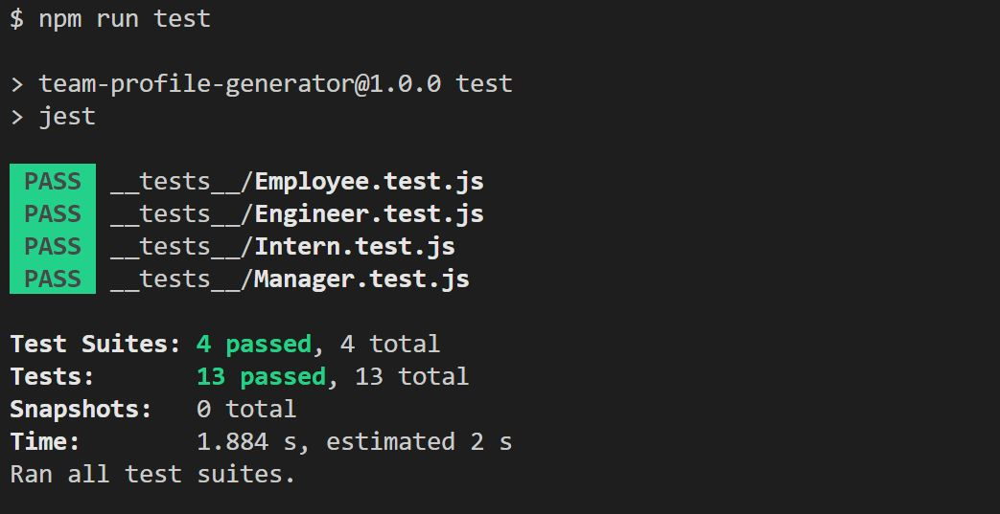

# Team Profile Generator

  

  

## Description
---------------------------------
This application is designed to generate a team profile quickly and easily by using a command-line application. This allows organizations to quickly view their team members information in one place.
## Table of Contents
---------------------------------
1. [Installation](#Installation)
2. [Usage](#Usage)
3. [License](#License)
4. [Contributing](#Contributing)
5. [Tests](#Tests)
6. [Questions](#Questions)

## Installation
----------------------------------
* Clone the repo @ [team-profile-generator](https://github.com/ettad/team-profile-generator)

## Usage
----------------------------------
* In your integrated terminal run `npm install` to install needed dependencies.
* To run the application, use `node index.js` in your terminal.
* To run the test, use `npm run test`

[Link to Demo](https://drive.google.com/file/d/1aLPn7t_BSTJNlCB6oaCrpwY9zKHg4qGq/view)

## Screenshots
----------------------------------

### Test Results
----------------------------------

## License
----------------------------------  
Licensed under the  

  

## Questions
----------------------------------
For more information, visit my GitHub profile at: https://github.com/ettad

